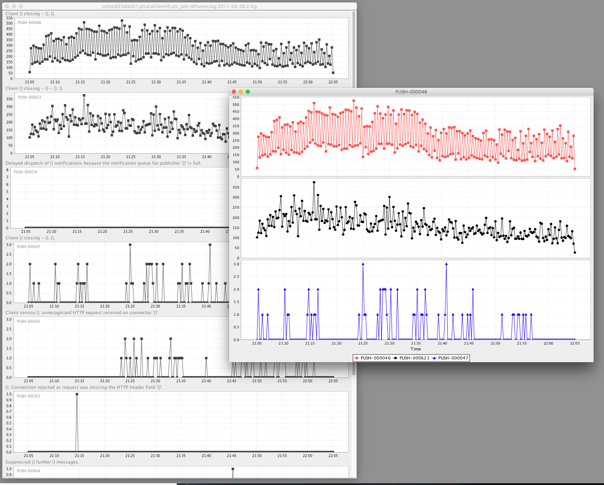

# Diffusion log visualiser

Visualise frequency of log markers from a Diffusion server log as line chart.

## Requirements

* Java 8
* Maven 3.5

## Quick start

```
git clone https://treacleminer@bitbucket.org/pushtechnology/server-log-analytics.git
mvn clean install
mvn exec:java
```

## Use



* Load a Diffusion log, and you are given a palette window of each `PUSH-` marker present in the log file.
* Double click on a data item to create a chart
* Control-Drag other data items to the chart to add them.
* Drill down into specific times on the chart window for emphasis.
* Right click on the chart window to navigate